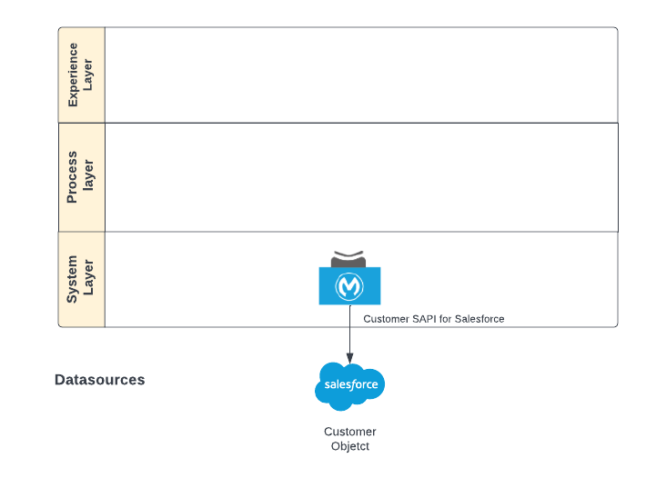

# mule-micorp-customer-sapi
> Mulesoft Demo System API - Micorp Salesforce Customer Repository

## Table of contents
1. [Architecture](#architecture) 
2. [Prerequisites](#prerequisites)
3. [Compilation](#compilation)
4. [Recommended content](#recommended-content)

<br>

## Architecture

Service for creating Customers in Salesforce using data from the Corporate Orders System. Next the architecture diagram:



<br>

## Prerequisites
To compile and build the project:
* Java Development Kit (JDK) 8. Must be version 8!
* Apache Maven, version 3.8 or later.
* IDE, Anypoint Studio or IntelliJ.

Deployment in Anypoint Exchange:
* Anypoint account credentials

<br>

## Compilation

### Environment variables
The Sensitive data was removed from the application configuration. The next
environment variables must be configured with the proper values:
* encrypt.key. This is the phrase used to encrypt properties
* anypoint.platform.client_secret. Anypoint Client Secret
* anypoint.platform.client_id. Anypoint Client Id

> Note: Get the client id and secret from Anypoint Platform -> https://anypoint.mulesoft.com/accounts/. Select the organization and retrieve information.

on mac example:
```bash
export encrypt_key=my-encryption-key
mvn clean package -Dencrypt.key=$encrypt_key
```

## Recommended content
* [To Configure MUnit Maven Plugin From the POM File](https://docs.mulesoft.com/munit/2.0/to-configure-munit-maven-plugin-maven)

---
[Markdown Cheatsheet](https://github.com/adam-p/markdown-here/wiki/Markdown-Cheatsheet)